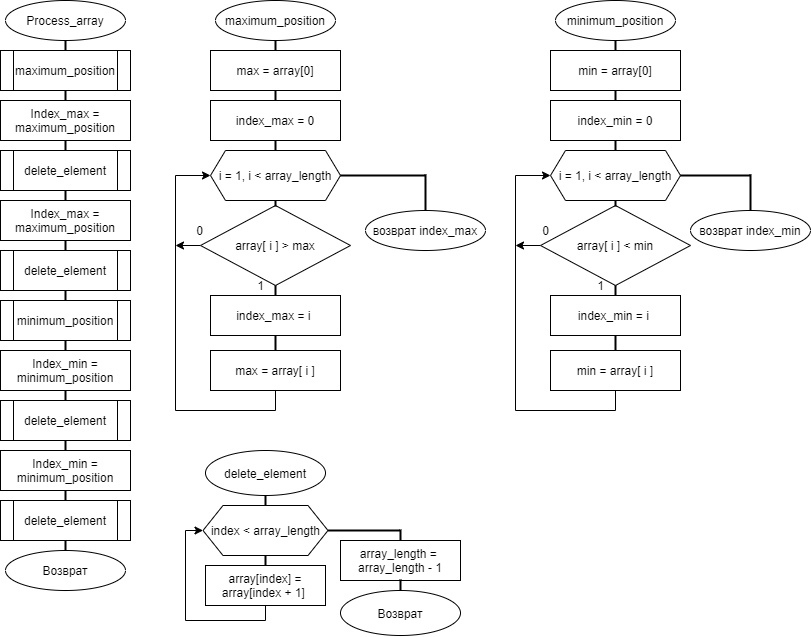

# Lab1_Proj

### Заголовок третьего уровня

Третье начало термодинамики (теорема Нернста, тепловая теорема Нернста) — физический принцип, определяющий поведение энтропии при приближении температуры к абсолютному нулю. 

Является одним из постулатов термодинамики, принимаемым на основе обобщения значительного количества экспериментальных данных по термодинамике гальванических элементов. Теорема сформулирована Вальтером Нернстом в 1906 году. 

Современная формулировка теоремы принадлежит Максу Планку.

>Цита́та (от лат. citare, citatum — провозглашать, приводить) — дословная выдержка из какого-либо текста.

### Пример списка

1.	Проводник
2.	Полупроводник
3.	Диэлектрик

### Пример блоков кода

  #include <iostream>
  #include "Circle_.cpp"
  using namespace std;
  int main()
  { setlocale(LC_ALL, ""); }

Первая часть текста, который необходимо разделить
***
Вторая часть текста, который необходимо разделить
  

